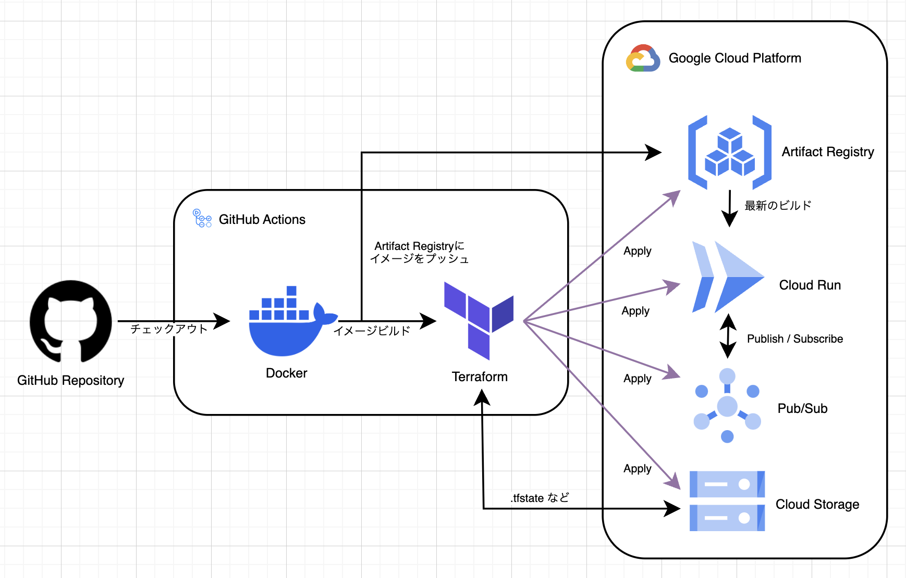

# Terraform Practice Oreo (仮名)
ぼくがTerraformの練習をするためのリポジトリ

- 私用のAWSアカウントを持っていないため、GCPでリソース作って練習しました（私用のAzureアカウントは持っているけど、GCPで練習したかった気分）
- Cloud Load Balancing を挟むのが一般的ですが、疎通できずに挫折する未来が見えそうなので、今回は省略しています（Cloud Run だけでもパブリックに公開できるよ）

## インフラ構成
Pub/Sub入れた理由は、今後他リソース・インスタンスと連携するときに、確実に使うと考えているからです

## サービスアカウント関連
GitHub ActionsでGCPの認証情報を利用するため、Actions用のサービスアカウントを作成しています

- 権限ロールは以下の2つ
- 「編集者」（練習のため今回は、権限過多な問題を許容）
- 「Cloud Run 管理者」（これがないとCloud RunのIAM設定（パブリックに公開するなど）ができない）
- Actions用のサービスアカウントのメアドに対して 2314.world のオーナー権限を付与（ドメインマッピングで所有権がないぞ問題が起きるため）

## ローカル開発環境
ローカルでPub/Subを検証するため、GCPのエミュレータを動かすためのコンテナを用意しています（疎通手間取りすぎて、貴重な休日を1日消費した）
